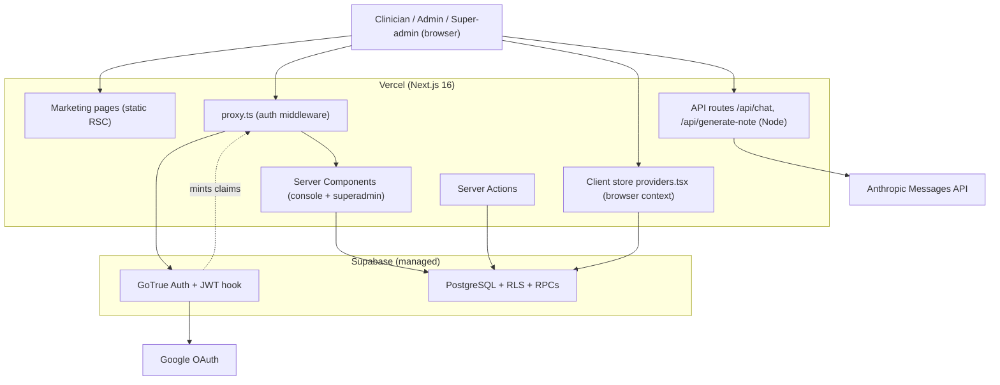
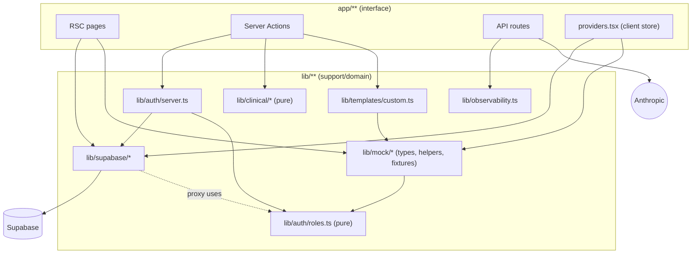
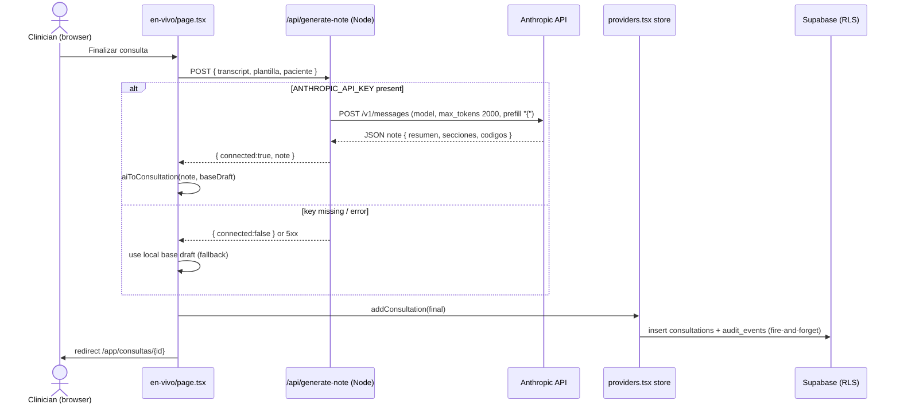
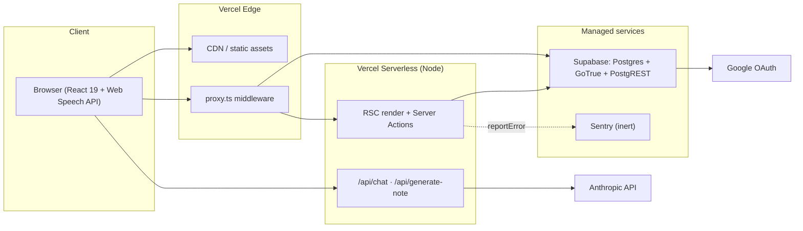
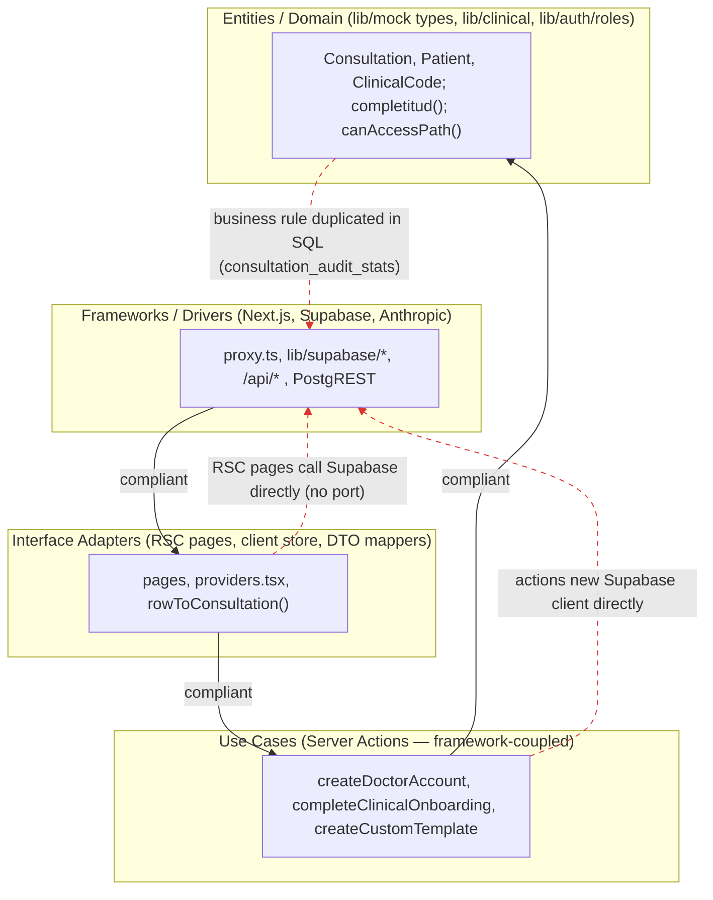
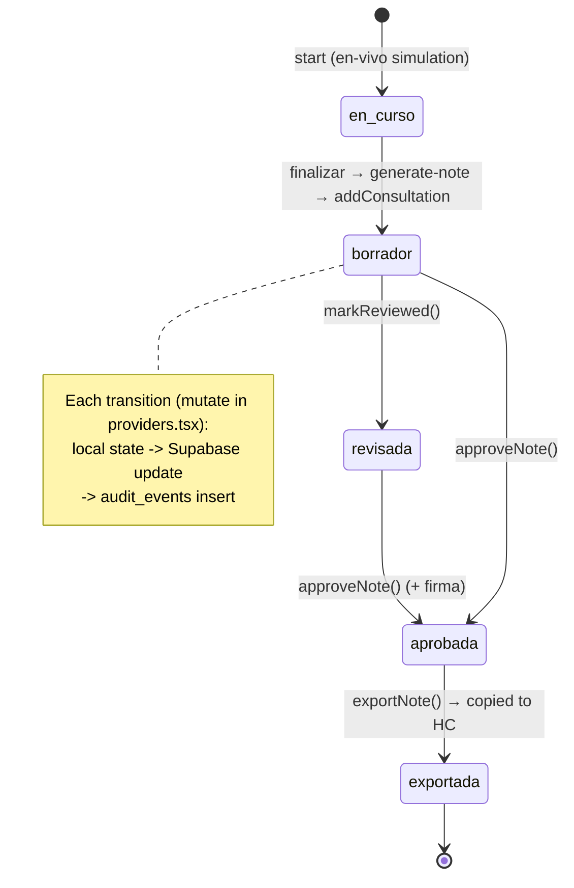

# System Overview

**Miracle** is a Spanish-language, Colombia-focused **clinical documentation SaaS** for healthcare professionals. It turns a medical consultation into a structured, coded (CIE-10 / CUPS), auditable clinical note, with AI assistance and human review. The codebase is a single **Next.js 16 (App Router) + React 19** application backed by **Supabase** (managed PostgreSQL + GoTrue auth + PostgREST + RLS), with two thin server-side API routes proxying **Anthropic's Messages API** for note generation and a clinical chat assistant.

- **Confirmed in `package.json`**: `next@16.2.9`, `react@19.2.4`, `@supabase/ssr@^0.12.0`, `@supabase/supabase-js@^2.108.2`, `motion@^12.42.2`, `lucide-react`, `tailwindcss@^4`, `vitest@^4`.
- **Confirmed in `AGENTS.md`**: the project runs a *modified* Next.js — "This is NOT the Next.js you know … APIs, conventions, and file structure may all differ." A concrete symptom: the middleware file is named **`proxy.ts`** and exports a **`proxy()`** function (not `middleware.ts` / `middleware()`).
- **Confirmed in `lib/observability.ts`** and `README.md`: intended deployment host is **Vercel** (`README.md` "Deploy on Vercel"; observability comment: "lo captura Vercel").

The product is in a **pilot/demo maturity stage**: parts of the UI still render illustrative KPI constants from `lib/mock/`, while the interactive console reads and writes **real Supabase data**.

---

# Architecture Summary

**Style: Modular monolith / serverless-rendered full-stack app.** A single deployable Next.js application provides both the marketing site and the authenticated console. There are no separate services, queues, or workers. "Backend" logic lives in three places:

1. **Next.js Server Components & Server Actions** (in-process, per-request) that talk to Supabase over PostgREST.
2. **Supabase PostgreSQL** — the real backend: schema, **Row-Level Security** for multi-tenant isolation, and **SECURITY DEFINER RPCs** that act as transactional application services (user provisioning, onboarding, aggregations).
3. **Two Node.js API routes** that proxy to the Anthropic API.

**Rendering is hybrid** (Confirmed by directive scan across `app/**/page.tsx`):

| Data/render style | Where | Data source |
|---|---|---|
| Static/SSG Server Components | all `app/(marketing)/*` pages | static content + `lib/site.ts` |
| Dynamic Server Components (cookie auth) reading Supabase directly | `pacientes`, `consultas`, `notas`, `auditoria`, `usuarios`, `configuracion`, `plantillas` (lists), `superadmin/*` | Supabase `.from()` / `.rpc()` |
| Client Components reading a React-Context store hydrated from Supabase | `dashboard`, `consultas/[id]`, `pacientes/[id]`, `consultas/nueva`, `consultas/en-vivo` (+ `ReportesView`, `CommandPalette`) | `useStore()` in `app/app/providers.tsx` → client-side Supabase load |
| Static illustrative KPIs (not real) | `dashboard` `AdminView`, parts of `ReportesView` | `lib/mock/metrics.ts` |

**Security posture is defense-in-depth** (Confirmed): `proxy.ts` (edge/middleware) gates protected routes by JWT claim → layouts re-check server-side (`app/app/layout.tsx:19`) → server actions re-check role → PostgreSQL **RLS** enforces org/role isolation at the data layer.

---

# Main Components

| Component | Path(s) | Responsibility | Evidence |
|---|---|---|---|
| Marketing site | `app/(marketing)/**` | Public pages (home, cómo-funciona, seguridad, casos-de-uso, piloto, recursos, contacto, demo) | Confirmed |
| Authenticated console | `app/app/**` | Consultations, patients, notes, templates, audit, reports, users, settings | Confirmed |
| Platform console | `app/superadmin/**` | Cross-org super-admin (orgs, users, overview) | Confirmed |
| Auth gate (middleware) | `proxy.ts`, `lib/supabase/proxy.ts` | Validate JWT, resolve role, redirect | Confirmed in `proxy.ts:9` matcher |
| Auth domain | `lib/auth/roles.ts`, `lib/auth/server.ts` | Role enum + `canAccessPath`; `getCurrentProfile`, `requireRole` | Confirmed |
| Supabase clients | `lib/supabase/{client,server,proxy}.ts` | Browser / RSC / middleware SSR clients | Confirmed |
| Client data store | `app/app/providers.tsx` | React-Context store; loads from Supabase, persists mutations | Confirmed |
| AI proxy routes | `app/api/chat/route.ts`, `app/api/generate-note/route.ts` | Proxy to Anthropic (chat, note generation) | Confirmed |
| Server actions | `app/**/actions.ts` (login, onboarding, usuarios, superadmin, plantillas, configuracion) | Mutations + validation + authz | Confirmed |
| Clinical domain | `lib/clinical/{codes,specialties,template-catalog}.ts` | CIE-10/CUPS catalog, 50 specialties, template generator | Confirmed |
| Domain types + rules + fixtures | `lib/mock/**` | TS interfaces, pure helpers (`completitud`, `ripsChecklist`), illustrative KPIs, seed data | Confirmed |
| Database | `supabase/migrations/*.sql` (16 files) | Schema, RLS, triggers, RPCs, JWT hook | Confirmed |
| Observability | `lib/observability.ts` | Single `reportError`; Sentry-ready but inert | Confirmed |
| Tests | `tests/*.test.ts` (4 files) | Unit tests of pure functions (Vitest) | Confirmed |
| CI | `.github/workflows/ci.yml` | lint → typecheck → test → build | Confirmed |

---

# Dependency Map

## External runtime dependencies

| Dependency | Purpose | Cited |
|---|---|---|
| **Supabase** (Postgres + GoTrue + PostgREST) | Auth, data, RLS, RPCs | `lib/supabase/*`, all `*/actions.ts`, RSC pages |
| **Anthropic Messages API** | Clinical note generation + chat | `app/api/chat/route.ts:54`, `app/api/generate-note/route.ts:51` (`https://api.anthropic.com/v1/messages`) |
| **Google OAuth** | Sign-in provider | `app/login/actions.ts:37` (`signInWithOAuth({ provider: "google" })`) |
| **WhatsApp (wa.me)** | Marketing conversion link | `lib/site.ts:16` |
| **Google Fonts** (Schibsted Grotesk, Geist Mono, Inter) | Typography via `next/font` | `app/layout.tsx:2` |
| **Web Speech API** (browser) | Voice dictation of note sections | `components/app/NoteSectionView.tsx` |
| **Sentry** | Error tracking (present but **inert**) | `lib/observability.ts:9,29` (gated on `NEXT_PUBLIC_SENTRY_DSN`, commented out) |

## Environment variables (names + purpose only)

Per safety constraints, values are **`[not analyzed — sensitive]`**. Names discovered by scanning source for `process.env.*`:

| Variable | Purpose | Source |
|---|---|---|
| `NEXT_PUBLIC_SUPABASE_URL` | Supabase project URL (client + server) | `lib/supabase/{client,server,proxy}.ts`, `login/actions.ts:26` |
| `NEXT_PUBLIC_SUPABASE_PUBLISHABLE_KEY` | Supabase anon/publishable key | same files |
| `NEXT_PUBLIC_SITE_URL` | Base URL fallback for OAuth redirect | `app/login/actions.ts:21` |
| `ANTHROPIC_API_KEY` | Server-side Anthropic auth (secret) | `app/api/chat/route.ts:44`, `generate-note/route.ts:21` |
| `ANTHROPIC_MODEL` | Overrides default model id | `app/api/chat/route.ts:62`, `generate-note/route.ts:59` |
| `NEXT_PUBLIC_SENTRY_DSN` | Enable Sentry reporting (currently unused) | `lib/observability.ts:9,29` |

> Note: `.env.local` and `.env.example` exist on disk but were **not opened** (safety constraint). All variable names above are derived solely from source-code references.

## Internal module dependencies (direction)

- `app/**` (interface) → `lib/auth`, `lib/clinical`, `lib/templates`, `lib/supabase`, `lib/mock` (inner/support). ✅ inward.
- `lib/mock/types.ts` → `lib/auth/roles.ts` (both pure). ✅
- `lib/clinical/template-catalog.ts` → `lib/mock/types.ts` (type only). ✅
- `lib/supabase/proxy.ts` → `lib/auth/roles.ts`. ✅
- Pure modules (`lib/auth/roles`, `lib/clinical/*`, `lib/mock` helpers) import **no** framework or Supabase code. ✅ (see CA-2)

---

# Execution Paths

### 1. Public marketing request
Browser → Vercel edge/CDN → static Server Component render (`app/(marketing)/*`) → HTML. No auth, no DB. **[estimate]** low ms.

### 2. Protected navigation (every `/app`, `/superadmin`, `/onboarding` request)
Browser → **`proxy.ts` → `lib/supabase/proxy.ts:updateSession`** → `supabase.auth.getClaims()` (validate JWT) → read `app_role` claim (fallback: `SELECT role FROM profiles`) → allow / redirect by `canAccessPath`. Then the **route layout re-checks** via `getCurrentProfile()` (`app/app/layout.tsx:19`). Latency-critical; on the hot path of every protected page.

### 3. Server-rendered data page (e.g. patients list)
Browser → RSC `app/app/pacientes/page.tsx` → `createClient()` (cookie-scoped) → `supabase.from("patients").select(..., {count:"exact"}).range()` + `supabase.rpc("patient_consultation_counts")` → RLS filters by org → HTML. Pagination in-DB (`PAGE_SIZE = 20`). Confirmed `pacientes/page.tsx:31-52`.

### 4. Client console session (dashboard / consultation detail)
`app/app/layout.tsx` → `MiracleProvider` mounts → `providers.tsx:load()` runs **4 parallel Supabase reads** (`patients` ≤500, `consultations` ≤300, `profiles`, then `audit_events` for loaded ids) → hydrates context → UI renders. Mutations (approve/export/review/code/edit) update local state **and** fire-and-forget writes back to Supabase (`persist`, `remoteAudit`). Confirmed `providers.tsx:159-303`.

### 5. AI note generation (the key async/AI path)
`app/app/consultas/en-vivo/page.tsx:finalizar()` → `fetch("/api/generate-note", POST {transcript, plantilla, paciente})` → route builds prompt → `fetch https://api.anthropic.com/v1/messages` (model `ANTHROPIC_MODEL || "claude-sonnet-4-6"`, `max_tokens: 2000`, JSON-forced via assistant-prefill `"{"`) → parse JSON → `{connected, note}` → client maps to a consultation and persists. **Falls back to a local base draft** if `ANTHROPIC_API_KEY` is unset or the call fails. Confirmed `generate-note/route.ts`, `en-vivo/page.tsx:223-248`.

### 6. Clinical chat
`components/app/MedicalChat.tsx` → `fetch("/api/chat", POST {messages})` (last 20 kept) → Anthropic (`max_tokens: 1024`, Spanish clinical system prompt) → `{reply, connected}`. Confirmed `chat/route.ts`.

### 7. Privileged provisioning (create a doctor / org)
`app/superadmin/actions.ts` or `app/app/usuarios/actions.ts` → validate → `supabase.rpc("create_org_member", …)` → **SECURITY DEFINER** function re-verifies caller role, inserts into `auth.users` + `auth.identities`, sets profile org/role — **without** a service-role key. Confirmed migration `20260630010000_create_org_member_rpc.sql`.

### 8. Sign-in
`app/login/actions.ts:signInWithPassword|signInWithGoogle` → GoTrue → OAuth returns to `app/auth/callback/route.ts` → `exchangeCodeForSession(code)` → redirect (open-redirect-guarded by `safeNext`). On first auth, trigger `on_auth_user_created → handle_new_user` provisions a personal org + admin profile (or joins an org from `app_metadata`). Confirmed `auth/callback/route.ts`, migration `20260630000000`.

---

# Infrastructure Requirements

| Component | Purpose | Runtime characteristics | Processing cost | Latency sensitivity | Deployment style | Special constraints | Recommended optimizations |
|---|---|---|---|---|---|---|---|
| Marketing pages (`app/(marketing)/*`) | Public site | Stateless, ephemeral, I/O-light | **Low** | **Low** | Serverless / Static (CDN) | None | Ensure static generation + CDN cache; already caps `next/image` device sizes (`next.config.ts:13`) |
| Auth gate `proxy.ts` | Route protection | Stateless, ephemeral, I/O-bound (JWT verify; occasional profiles read) | **Low** | **Critical** (every protected request) | Edge / Middleware | Must stay fast; DB fallback adds a round-trip when the JWT claim is absent | **Enable the custom access-token hook** so the role is always in-claim (removes fallback query); keep verification edge-local |
| RSC data pages (`pacientes`,`consultas`,`notas`,`auditoria`,`usuarios`,`configuracion`,`plantillas`, `superadmin/*`) | Server-rendered data views | Stateless, ephemeral, I/O-bound (PostgREST) | **Low–Medium** | **Medium** | Serverless (Node) | Dynamic (cookies) → not cacheable; per-request DB | Keep in-DB pagination/aggregation (already done via RPCs); add per-request caching where safe |
| Server actions (`*/actions.ts`) | Mutations/authz | Stateless, ephemeral, I/O-bound | **Low** | **Medium** | Serverless (Node) | Re-validate role; rely on RLS | Fine as-is; add structured audit |
| **AI routes** (`/api/chat`, `/api/generate-note`) | LLM proxy | Stateless, ephemeral, **I/O-bound (outbound LLM)**, non-streaming | **High–Very High** (token inference; 1024–2000 out) | **High** (user waits for the note) | Serverless (Node, `runtime="nodejs"`) | **No auth guard**; **not in proxy matcher**; serverless **timeout** vs. multi-second LLM; no `maxDuration` set; no transcript size cap in generate-note | **Add session auth + rate limiting**; **stream** responses; set `export const maxDuration`; cap transcript length |
| Client store (`providers.tsx`) | Console data cache | **Stateful (browser memory)**, always-on per session | **Medium** | **Medium** (blocks console with a spinner until loaded) | Client (browser) | Bulk-loads ≤300 consultations + ≤500 patients + all profiles on mount | Scope load by role/date; move to server-fetched, paginated reads or a query cache |
| **Supabase** (Postgres + GoTrue + PostgREST) | System of record, auth, RLS, RPCs | **Stateful, always-on, managed** | **Medium** | **Medium** | Managed (external) | RLS on every table; JWT hook must be enabled in dashboard; `create_org_member` writes GoTrue internal tables | Monitor RLS query plans; FK indexes already added (`20260630020000`) |
| Anthropic API | Note/chat inference | External, stateful upstream | **Very High** | **High** | External SaaS | Rate limits, cost, key secrecy | Cache/cap tokens; protect the key (see AI routes) |
| Google OAuth / GoTrue | Identity | External/managed | **Low** | **Medium** | Managed | Redirect allow-list | Keep `safeNext` guard |

Timing values are **[estimate]** where noted; exact latencies are not measurable from static analysis.

---

# Processing Cost and Runtime Notes

- **Only the AI routes are cost/latency-significant.** Everything else is thin request/response over PostgREST. `generate-note` requests up to `max_tokens: 2000` and **awaits the full response** (no streaming), so wall-clock is dominated by Anthropic inference — **[estimate]** several seconds. This collides with serverless function timeouts (Vercel Hobby ≈10 s, Pro ≈60 s by default) and no `maxDuration` is declared. Confirmed `generate-note/route.ts:58-67`.
- **`chat` bounds history to the last 20 messages** (`chat/route.ts:38`) — good cost control. **`generate-note` has no input-size cap** on `transcript` — an unbounded transcript inflates token cost. Confirmed.
- **Client hydration cost**: the console shows a full-screen spinner until `load()` resolves 4 queries (`providers.tsx:537-543`); for large orgs the ≤300/≤500 caps bound memory but the initial payload can still be heavy. Confirmed.
- **CPU-heavy work**: none server-side. Voice dictation (`NoteSectionView`) runs on the **client** via Web Speech API — zero server cost. No image/video/GPU processing anywhere.
- **No always-on processes, cron jobs, queues, brokers, or WebSockets.** The "live" consultation (`en-vivo`) is a **simulation** driven by `setInterval` over a hardcoded `SCRIPT`, not a real audio/STT stream. Confirmed `en-vivo/page.tsx:210-221`.

---

# Optimization Opportunities

1. **Secure the AI routes (highest priority).** `/api/chat` and `/api/generate-note` perform **no authentication** and are **excluded from the `proxy.ts` matcher** (which only covers `/app`, `/superadmin`, `/onboarding` — `proxy.ts:9`). Anyone can invoke them and burn the `ANTHROPIC_API_KEY`. Add a session check (`getCurrentProfile`) + rate limiting. **Confirmed** (no auth code in either route).
2. **Stream AI responses & set `maxDuration`.** Convert both routes to streaming and declare `export const maxDuration` to avoid gateway timeouts and improve perceived latency.
3. **Enable the custom access-token hook.** The function exists (`20260630050000`) but is **inert until enabled in the Supabase dashboard**; enabling it removes the per-request `profiles` fallback read in `proxy.ts:52-59`.
4. **Reconcile the client store with server pagination.** List pages already moved to in-DB pagination/aggregation; the bulk client load in `providers.tsx` is now the odd one out. Scope it (by role/recent window) or replace with query-cache reads.
5. **Single source of truth for the RIPS/completeness rule.** `completitud`/`ripsChecklist` (`lib/mock/index.ts:79-101`) is **re-implemented in SQL** (`consultation_audit_stats`, `20260630080000` — its header says "Replica la fórmula de `completitud`"). These will drift. Centralize.
6. **Introduce a data-access layer (ports/repositories).** Supabase calls are scattered across RSC pages, server actions, and the client store. A repository seam would improve testability and decouple from PostgREST (see CA-5/CA-7).
7. **Remove/relocate dead demo data.** The seed arrays `patients` (`lib/mock/people.ts`) and `consultations` (`lib/mock/consultations.ts`) are **not imported at runtime** (Inferred — no runtime import found; only types, helpers, `doctors`, `templates`, and static KPIs are used). Separate real domain types/helpers from demo fixtures, and rename `lib/mock` accordingly.
8. **Enable Sentry.** `reportError` is Sentry-ready but commented out (`lib/observability.ts:28-29`).

---

# Clean Architecture Evaluation

### Score table

| # | Principle | Score (0–4) | Compliance % | Status |
|---|---|---|---|---|
| CA-1 | Layer Separation | 2 | 50% | 🟠 |
| CA-2 | Dependency Rule | 3 | 75% | 🟡 |
| CA-3 | Entities / Domain Model | 2 | 50% | 🟠 |
| CA-4 | Use Cases / Application Layer | 2 | 50% | 🟠 |
| CA-5 | Ports & Adapters | 1 | 25% | 🔴 |
| CA-6 | Frameworks at the Edge | 2 | 50% | 🟠 |
| CA-7 | Testability | 2 | 50% | 🟠 |
| | **Overall** | **14/28** | **50%** | 🟠 |

Status: 🔴 0–25% · 🟠 26–50% · 🟡 51–75% · 🟢 76–100%. Overall = (14 ÷ 28) × 100 = **50%**.

> Interpretation: this is a **well-built but conventional** Next.js + Supabase app. It never sets out to implement formal Clean Architecture — it leans into framework idioms (RSC, Server Actions, RLS). Its pure modules are clean and correctly-directed; its data access is framework-coupled and port-less.

---

### CA-1 — Layer Separation · Score 2 (50%) 🟠
*Cohesive support modules exist, but business orchestration and data access are interleaved with the framework.*

**Compliant examples**
- `lib/auth/roles.ts` — pure authorization policy (`canAccessPath`, `isAppRole`), no framework imports.
- `lib/clinical/{codes,specialties,template-catalog}.ts` — self-contained clinical domain data + search.
- `lib/supabase/*` isolates client construction from callers.

**Violations**
- RSC pages call the data store directly: `app/app/pacientes/page.tsx:31` (`supabase.from("patients")...`) — persistence concerns inside an interface component.
- Server actions mix validation + data access + framework primitives (`app/superadmin/actions.ts` uses `FormData`, `redirect`, `revalidatePath`, and `supabase.from(...)` together).
- AI prompt/business logic lives inside the HTTP handler (`app/api/generate-note/route.ts:36-46`).

**Most impactful improvement:** extract a data-access/service layer so pages and actions depend on it instead of PostgREST directly.

---

### CA-2 — Dependency Rule · Score 3 (75%) 🟡
*Dependencies point inward; inner modules import no framework/ORM. Partly satisfied by a thin domain, but genuinely clean.*

**Compliant examples**
- `lib/auth/roles.ts`, `lib/clinical/*`, and `lib/mock` helpers import **no** Next.js or Supabase code.
- `lib/mock/types.ts:3` depends only on `lib/auth/roles.ts` (inner → inner).
- `server-only` guards prevent server modules leaking into client bundles (`lib/supabase/server.ts:1`, `lib/auth/server.ts:1`).

**Violations**
- No *enforced* boundary (e.g. lint import rules); compliance is conventional.
- The "domain" is thin, so the rule is easy to satisfy by omission rather than design.
- `lib/mock` couples reusable types/helpers with demo fixtures, blurring what "inner" means.

**Most impactful improvement:** add ESLint import-boundary rules to make the inward rule intentional and durable.

---

### CA-3 — Entities / Domain Model · Score 2 (50%) 🟠
*Framework-agnostic types, but anemic and duplicated across TS and SQL.*

**Compliant examples**
- `lib/mock/types.ts` — `Consultation`, `Patient`, `ClinicalCode` are plain interfaces, **no ORM decorators**, framework-free.
- Enumerations/labels centralized (`STATUS_LABEL`, `TYPE_LABEL`, `lib/auth/roles.ts`).

**Violations**
- **Anemic model**: entities carry no behavior; rules live in free functions (`completitud`, `ripsChecklist` in `lib/mock/index.ts`).
- **Rule duplication in the database**: `supabase/migrations/20260630080000_consultation_audit_stats.sql` re-implements the completeness formula (its own comment says so).
- The domain model lives under a folder literally named **`mock`**, conflating model with fixtures.

**Most impactful improvement:** promote the model to `lib/domain`, and make the completeness/RIPS rule one authority consumed by both TS and SQL.

---

### CA-4 — Use Cases / Application Layer · Score 2 (50%) 🟠
*Each use case is centralized in one Server Action + often a SECURITY DEFINER RPC, but there is no framework-independent application layer and no DI.*

**Compliant examples**
- One action per use case, cohesive: `completeClinicalOnboarding` (`app/onboarding/actions.ts`), `createDoctorAccount` / `assignUserToOrg` / `createOrganization` (`app/superadmin/actions.ts`).
- Privileged workflows delegated to transactional, self-authorizing RPCs: `create_org_member`, `complete_clinical_onboarding` (migrations).

**Violations**
- Actions are framework-bound (`FormData`, `redirect`, `revalidatePath`) — they *are* the controllers.
- They instantiate infrastructure directly: `const supabase = await createClient()` (equivalent to `new`-ing an adapter), no injected ports — e.g. `app/app/plantillas/actions.ts:53`.
- No application layer callable outside a Next.js request.

**Most impactful improvement:** move orchestration into plain `use-case` functions that receive a repository port; let actions be thin adapters that call them.

---

### CA-5 — Ports & Adapters · Score 1 (25%) 🔴
*No ports/interfaces; data access is direct-to-Supabase everywhere. The only redeeming trait is consistent DTO mapping.*

**Compliant examples (partial)**
- Explicit DB-row → domain **DTO mappers**: `rowToConsultation` / `rowToPatient` (`app/app/providers.tsx:91,106`) and `customTemplateToTemplate` (`lib/templates/custom.ts:17`).
- Per-page row DTO types (e.g. `PatientRow` in `app/app/pacientes/page.tsx:9`).

**Violations**
- **No interface/port anywhere** — nothing abstracts Supabase; it cannot be swapped or faked.
- Controllers/pages/store call PostgREST directly (`.from()`, `.rpc()`) across RSC pages, actions, and the client store.
- No inversion of control: dependencies are concrete and imported, not injected.

**Most impactful improvement:** define repository interfaces (e.g. `ConsultationRepository`) in the domain and implement a single Supabase adapter behind them.

---

### CA-6 — Frameworks at the Edge · Score 2 (50%) 🟠
*Some framework confinement (server-only, centralized clients, AI HTTP in routes), but Next.js and Postgres permeate the logic.*

**Compliant examples**
- Supabase client creation confined to `lib/supabase/*`.
- Outbound LLM HTTP confined to `app/api/*` route handlers.
- Pure modules free of framework types (`lib/clinical/*`, `lib/auth/roles.ts`).

**Violations**
- Framework types drive core logic: `NextRequest`/`NextResponse` in `lib/supabase/proxy.ts`, `FormData`/`redirect` throughout actions.
- Business rules pushed into **Postgres** (RLS policies, RPCs) — logic bound to a specific engine.
- Supabase client is instantiated inline in pages/store rather than provided at the edge.

**Most impactful improvement:** keep framework request/response types out of anything below the route/action boundary by translating to plain inputs immediately.

---

### CA-7 — Testability · Score 2 (50%) 🟠
*The pure half is unit-tested with no DB; the data/orchestration half is untestable as written.*

**Compliant examples**
- `tests/roles.test.ts`, `tests/codes.test.ts`, `tests/clinical-rules.test.ts`, `tests/site.test.ts` run in a **`node` env with no DB/env** (`vitest.config.ts:6`).
- Functions under test are pure (`canAccessPath`, `searchCodes`, `completitud`), so they need no mocks.
- CI runs the suite on every push/PR (`.github/workflows/ci.yml`).

**Violations**
- **Zero tests** for server actions, RPCs, RLS, data access, or components.
- Supabase-touching code can't be unit-tested without a live DB because there is no port to substitute (`getCurrentProfile`, the store, every action).
- No dependency injection anywhere.

**Most impactful improvement:** the CA-5 repository seam directly unlocks testing of use cases with in-memory fakes; add RLS integration tests against a disposable Supabase.

---

### CA Improvement Roadmap
*Ordered by highest score gain first, then lowest effort.*

| Priority | Action | Effort | Affected Files / Paths | CA Principles |
|---|---|---|---|---|
| P1 | Introduce repository **ports** + a single Supabase **adapter**; route all reads/writes through them | High | `lib/data/*` (new), `app/app/**/page.tsx`, `app/**/actions.ts`, `app/app/providers.tsx` | CA-5, CA-2, CA-6 |
| P2 | Extract framework-free **use-case functions**; make Server Actions thin adapters that inject a repo | Medium | `app/**/actions.ts`, `lib/usecases/*` (new) | CA-4, CA-1 |
| P3 | Add **unit tests** for use cases (in-memory repo) + **RLS integration tests** | Medium | `tests/**` | CA-7 |
| P4 | Promote domain out of `lib/mock` → `lib/domain`; split fixtures; **de-dupe the completeness rule** (TS ↔ SQL) | Medium | `lib/mock/**`, `supabase/migrations/20260630080000_*.sql` | CA-3 |
| P5 | Keep `NextRequest`/`FormData` at the edge; translate to plain DTOs before calling use cases | Low | `lib/supabase/proxy.ts`, `app/**/actions.ts` | CA-6, CA-1 |
| P6 | Add ESLint **import-boundary** rules to enforce the dependency rule | Low | `eslint.config.mjs` | CA-2 |

---

# Risks and Constraints

| # | Risk | Severity | Evidence |
|---|---|---|---|
| R1 | **Unauthenticated AI endpoints.** `/api/chat` & `/api/generate-note` have no session check and are outside the `proxy.ts` matcher → public LLM invocation = cost/DoS on `ANTHROPIC_API_KEY`. | **High** | `app/api/chat/route.ts` (no auth), `proxy.ts:9` (matcher excludes `/api`) |
| R2 | **Migration ↔ live-DB drift.** RLS policies call `private.is_admin()` and assume `role` is TEXT, but the migration header states the helper "solo existe en la base viva" and the schema diverged. A fresh environment built from migrations alone would be missing objects. | **High** | `supabase/migrations/20260628000000_*.sql:83,94` (uses `private.is_admin()`); `20260630000000_*.sql:16-18` header (documents the drift) |
| R3 | **Non-streaming LLM vs. serverless timeout.** `generate-note` awaits up to 2000 tokens with no `maxDuration`; may exceed function limits. | Medium | `app/api/generate-note/route.ts:58-67` |
| R4 | **Hardcoded default model id** `claude-sonnet-4-6`. If invalid/unavailable, every AI call 4xx-fails (silently degrades to the local base draft). Value should be verified. | Medium | `app/api/{chat,generate-note}/route.ts` |
| R5 | **Manual, out-of-code setup steps.** The JWT access-token hook must be enabled in the Supabase dashboard; the first super-admin is promoted by hand-run SQL. Undocumented in code → deploy runbook risk. | Medium | `20260630050000_*.sql` header; `20260630000000_*.sql:201-208` |
| R6 | **GoTrue-internal coupling.** `create_org_member` inserts directly into `auth.users`/`auth.identities` — fragile across Supabase upgrades. | Medium | `20260630010000_create_org_member_rpc.sql:78-103` |
| R7 | **Client bulk-load scalability.** Console hydrates ≤300 consultations + ≤500 patients + all profiles per session; large orgs strain memory/first-paint. | Medium | `app/app/providers.tsx:87-88,159-208` |
| R8 | **PHI handling.** Real patient/clinical data flows to the browser store and to Anthropic. Consent is a per-org toggle (`require_consent`) but enforcement is UI-side; observability is careful to avoid PHI in logs (good), yet transport to a third-party LLM needs an explicit legal basis (Colombia). | Medium | `20260630030000_org_settings.sql`, `lib/observability.ts:11-12`, `docs/legal-colombia.md` |
| R9 | **Modified Next.js.** Non-standard build (middleware renamed `proxy.ts`) → upgrades, docs, and third-party tooling may not apply. | Low–Medium | `AGENTS.md`, `proxy.ts` |
| R10 | **Dead demo data shipped.** Unused seed arrays inflate the bundle/confuse contributors about the real data source. | Low | `lib/mock/people.ts`, `lib/mock/consultations.ts` (no runtime import found) |

---

# Open Questions

1. **Are `/api/chat` and `/api/generate-note` meant to be public?** No auth exists in code; confirm intent. *(Cannot be resolved from static analysis.)*
2. **Is the custom access-token hook enabled** in the production Supabase project? The code only provides the function; enablement is dashboard-side. *(Not visible in code.)*
3. **Which is the source of truth — the migrations or the live DB?** The drift note in `20260630000000` implies the live DB leads. Where is `private.is_admin()` defined?
4. **Is `claude-sonnet-4-6` the intended model id?** It is a hardcoded default; verify against the account's available models.
5. **Deployment target = Vercel?** Inferred from `README.md` + `lib/observability.ts`; no `vercel.json` is present to confirm. *(Inferred.)*
6. **Real ambient-audio capture roadmap?** Today `en-vivo` is a scripted simulation and dictation uses the browser Web Speech API — no server STT is integrated. Is a real audio→transcript pipeline planned (which would change the infra profile substantially)?
7. **Is Sentry intended for launch?** It is wired but inert.

---

# Infrastructure Recommendation Summary

**Keep the current stack — it fits the workload.** A single Next.js app on **Vercel** (serverless functions + edge middleware + CDN) plus **Supabase** (managed Postgres/Auth with RLS) is the right shape for a pilot-stage clinical SaaS: no queues, brokers, GPUs, or always-on workers are warranted by anything in the code.

**Before scaling / going to production, address in order:**
1. **Authenticate and rate-limit the AI routes** (R1) — the single most urgent gap.
2. **Make the AI path production-grade** — stream responses, set `maxDuration`, cap transcript size (R3).
3. **Reconcile migrations with the live DB** — commit `private.is_admin()`, the `role`-as-TEXT change, and the enum handling as real migrations so environments are reproducible (R2); document the manual hook/super-admin steps (R5).
4. **Enable the JWT access-token hook** to drop the per-request fallback query (perf).
5. **Bound the client store** or move console reads server-side/paginated (R7).
6. **Introduce a repository/ports layer** — the one change that most improves testability and long-term maintainability (CA-5 → CA-4 → CA-7).

**Estimated infra tier for pilot:** Supabase Pro + Vercel Pro (for the 60 s function limit and to accommodate LLM latency), one Anthropic key with usage caps/alerts. No horizontal-scale infrastructure needed at current volumes. **[estimate]**

---

# Appendix: Mermaid Diagrams

## 1. High-level system architecture

## 2. Module / service dependency graph

## 3. Primary request/data flow — AI note generation

## 4. Infrastructure deployment topology

## 5. Clean Architecture layer map (dashed red = dependency-rule violation)

## 6. Key async / event flow — consultation lifecycle

