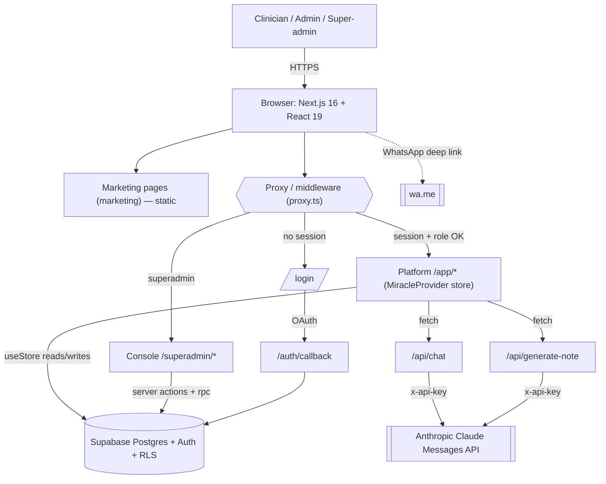
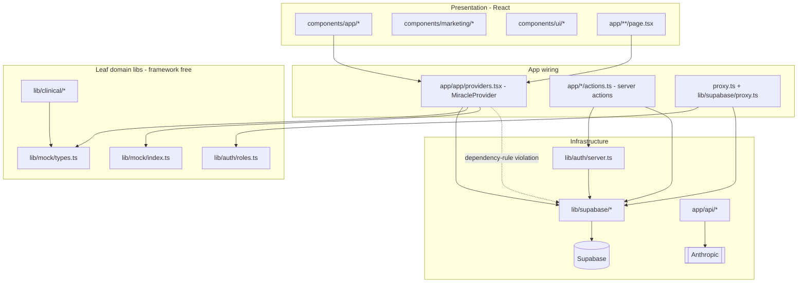
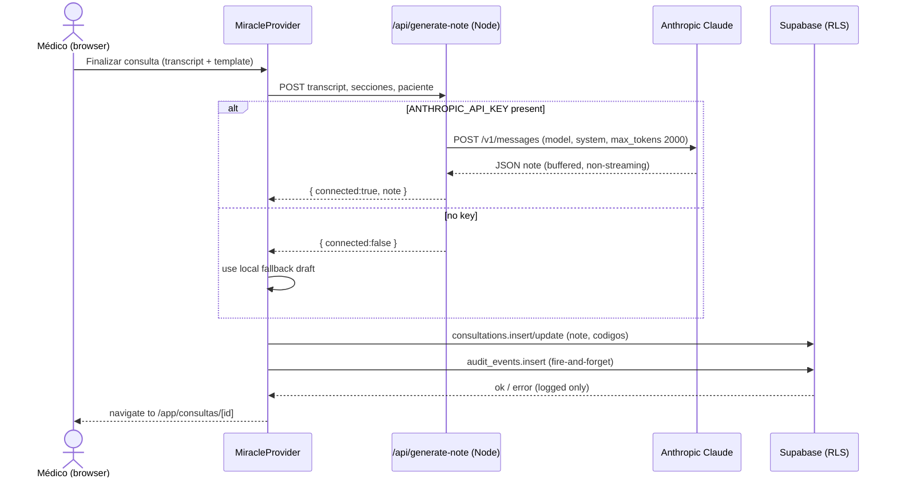
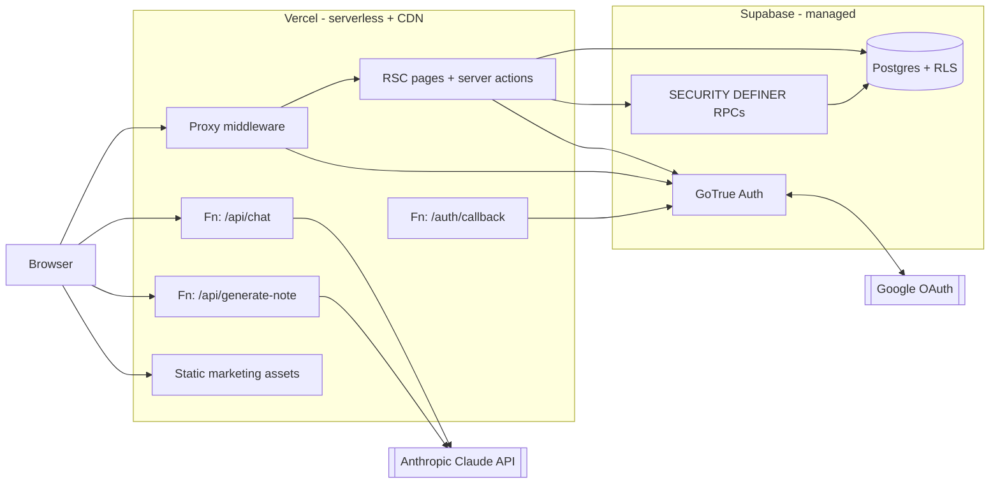
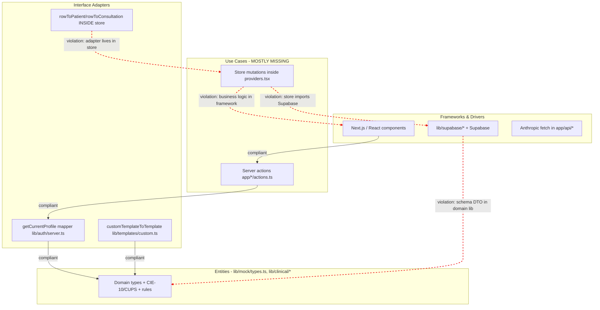
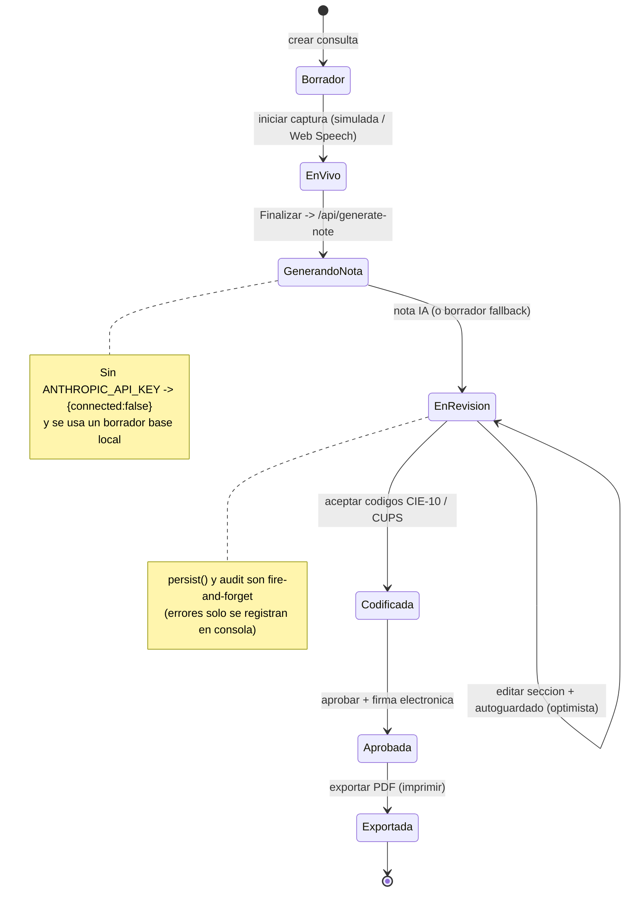

# Miracle — Architecture & Infrastructure Analysis

> Scope: static analysis of the `Pagina-web-clientes-final` repository (the **Miracle web** product).
> Method: every claim cites a file path and is tagged **Confirmed in `<file>`** (read directly) or **Inferred from `<file>`** (deduced from usage). Timing that cannot be measured from code is tagged `[estimate]`.
> Safety: no `.env`/secret files were read. Environment variables are documented by **name and purpose only**; values are `[not analyzed — sensitive]`.

---

# System Overview

Miracle is a **clinical "ambient scribe" and clinical‑operational intelligence platform** for healthcare professionals in Colombia. A clinician runs a consultation, the app assembles a structured clinical note (with AI assistance), the clinician edits/codes (CIE‑10 / CUPS) and signs it, and everything is auditable for RIPS. (Confirmed in `app/api/generate-note/route.ts`, `CONTEXTO.md`, `docs/prd-miracle-v0.md`.)

- **Type of system:** Multi‑tenant SaaS web application (B2C solo clinicians + B2B hospitals). (Confirmed in `supabase/migrations/20260628000000_multi_tenant_organizations.sql`.)
- **Primary stack:** Next.js 16.2.9 (App Router) · React 19.2.4 · TypeScript 5 · Tailwind CSS v4 · Supabase (Postgres + Auth) · Anthropic Claude API. (Confirmed in `package.json`.)
- **Two products, one repo:** only the **web** product lives here; the "Milagro" Chrome extension that copies notes into hospital HIS is out of scope. (Confirmed in `CONTEXTO.md`; no extension code in the tree.)

---

# Architecture Summary

**Style:** a **serverless modular monolith** on the Next.js App Router, backed by a **managed BaaS (Supabase)** and one external LLM (Anthropic). There is no separate backend service, message broker, queue, or container. (Confirmed in `package.json`, `next.config.ts`; **absence** of `Dockerfile`, `docker-compose.yml`, `vercel.json`, `.github/workflows/`, any queue/worker config — Confirmed by inventory scan.)

Three tiers coexist inside one Next.js app:

1. **Public marketing site** — statically renderable pages under the `(marketing)` route group. (Confirmed in `app/(marketing)/`.)
2. **Authenticated platform** — the clinical app under `app/app/`, a **client‑heavy SPA‑style shell** whose single React context (`MiracleProvider`) is the *only* bridge to Supabase for clinical data. (Confirmed in `app/app/providers.tsx`.)
3. **Platform console** — the super‑admin area under `app/superadmin/` (organizations & users across all tenants). (Confirmed in `app/superadmin/`.)

Cross‑cutting concerns:

- **Auth & routing gate:** a Next.js *proxy* (middleware) validates the session and enforces role/path rules on every protected request. (Confirmed in `proxy.ts`, `lib/supabase/proxy.ts`.)
- **Data + security:** all persistence and multi‑tenant isolation live in Postgres via **Row‑Level Security (RLS)** and `SECURITY DEFINER` helper functions. (Confirmed in `supabase/migrations/`.)
- **AI:** two stateless Node route handlers proxy to the Anthropic Messages API, degrading gracefully when no key is present. (Confirmed in `app/api/chat/route.ts`, `app/api/generate-note/route.ts`.)

---

# Main Components

| Component | Path | Responsibility | Notes |
|---|---|---|---|
| Root layout + theming | `app/layout.tsx`, `app/globals.css` | HTML shell, fonts, anti‑flash dark‑mode script | Confirmed |
| Marketing pages | `app/(marketing)/*` | Public landing + subpages (demo, seguridad, piloto, contacto…) | Confirmed; mostly static |
| Platform layout + store | `app/app/layout.tsx`, `app/app/providers.tsx` | Server‑side auth check, then renders the client `MiracleProvider` store | `providers.tsx` is the architectural center — Confirmed |
| Clinical feature pages | `app/app/{dashboard,consultas,pacientes,notas,plantillas,auditoria,reportes,usuarios,configuracion}/` | Screens consuming `useStore()` | Confirmed |
| Super‑admin console | `app/superadmin/{page,organizaciones,usuarios}` + `actions.ts` | Cross‑tenant management | Confirmed |
| AI route handlers | `app/api/chat/route.ts`, `app/api/generate-note/route.ts` | Proxy to Anthropic; fallback without key | Confirmed |
| OAuth callback | `app/auth/callback/route.ts` | Exchange OAuth code → session | Confirmed |
| Server actions | `app/*/actions.ts` (`login`, `onboarding`, `usuarios`, `plantillas`, `superadmin`) | Mutations + auth‑guarded operations | Confirmed |
| Auth/RBAC library | `lib/auth/roles.ts`, `lib/auth/server.ts` | Role model, `canAccessPath`, `getCurrentProfile`, `requireRole` | Confirmed |
| Supabase clients | `lib/supabase/{client,server,proxy}.ts` | Browser / server / middleware Supabase SSR clients | Confirmed |
| Clinical domain data | `lib/clinical/{codes,specialties,template-catalog}.ts` | CIE‑10/CUPS catalog + search, 46 specialties, template catalog | Confirmed; framework‑agnostic |
| Domain types + rules | `lib/mock/{types,index,metrics,people,consultations,templates}.ts` | Domain types + pure helper rules (`statusTone`, `ripsChecklist`, `completitud`) | Confirmed; note the `mock/` name is legacy — types are the live domain model |
| Template adapter | `lib/templates/custom.ts` | Supabase row → `Template` mapper | Confirmed |
| UI kit | `components/ui/*`, `components/app/*`, `components/marketing/*`, `components/brand/*`, `components/superadmin/*` | Presentational + interactive React components | Confirmed |
| Database schema | `supabase/migrations/*.sql` (8 files) | Tables, RLS, triggers, RPCs | Confirmed |

**Notably absent (Confirmed by scan):** unit/integration tests (`*.test.*`, `*.spec.*`, `__tests__/`), CI (`.github/workflows/`), containerization (`Dockerfile`), infra‑as‑code, and any `vercel.json`.

---

# Dependency Map

**Production dependencies** (Confirmed in `package.json`):

| Package | Version | Purpose |
|---|---|---|
| `next` | 16.2.9 | App Router framework, RSC, route handlers, middleware/proxy |
| `react`, `react-dom` | 19.2.4 | UI runtime |
| `@supabase/ssr` | ^0.12.0 | Cookie‑based Supabase clients for browser/server/middleware |
| `@supabase/supabase-js` | ^2.108.2 | Supabase JS SDK (queries, auth, `rpc`) |
| `lucide-react` | ^1.21.0 | Icon set |

**Dev dependencies:** `tailwindcss` ^4 + `@tailwindcss/postcss`, `typescript` ^5, `eslint` ^9 + `eslint-config-next` 16.2.9, `@types/*`. (Confirmed in `package.json`.)

**External services:**

| Service | How reached | Evidence |
|---|---|---|
| Supabase Postgres + Auth | `@supabase/ssr` / `supabase-js` over HTTPS; cookies for session | Confirmed in `lib/supabase/*` |
| Anthropic Claude Messages API | `fetch("https://api.anthropic.com/v1/messages")` | Confirmed in `app/api/chat/route.ts:53`, `app/api/generate-note/route.ts:50` |
| Google OAuth | via Supabase Auth `signInWithOAuth({provider:"google"})` | Confirmed in `app/login/actions.ts` |
| WhatsApp (deep link only) | `https://wa.me/<number>` URL builder | Confirmed in `lib/site.ts` |

**Internal dependency direction (high level):** `components/* → app/app/providers.tsx (useStore) → lib/supabase → Supabase`; and `lib/clinical`, `lib/mock`, `lib/auth/roles` are **leaf** modules with no framework imports. The dependency‑rule violation is that the store (`providers.tsx`) imports the Supabase client directly rather than through an abstraction (see Clean Architecture, CA‑2). (Confirmed in `app/app/providers.tsx`.)

---

# Execution Paths

### A. Login → protected app (Confirmed in `app/login/actions.ts`, `app/auth/callback/route.ts`, `proxy.ts`, `lib/supabase/proxy.ts`, `app/app/layout.tsx`)
1. `/login` → server action `signInWithGoogle()` or `signInWithPassword()`.
2. Google path redirects to `/auth/callback?next=/app/dashboard`; the **GET** route handler calls `exchangeCodeForSession(code)` and redirects to a `safeNext()`‑validated path.
3. Every `/app/*`, `/superadmin/*`, `/onboarding` request passes the **proxy**: `getClaims()` validates the JWT, then a `profiles.role` lookup drives redirects (no session → `/login`; superadmin → `/superadmin`; role/path mismatch → `/app/dashboard?error=forbidden`).
4. `app/app/layout.tsx` re‑checks the profile server‑side and forces `medico` onboarding when incomplete.

### B. App data load (Confirmed in `app/app/providers.tsx`)
On mount, `MiracleProvider.load()` issues parallel reads — `patients`, `consultations`, `audit_events`, `profiles` — with `select("*")` (no pagination), maps rows via `rowToPatient`/`rowToConsultation`, indexes audit by `consultation_id`, and flips `loading:false`. **No realtime subscription or polling** exists (Confirmed: no `.on(`/`subscribe`/`setInterval` in the store beyond a 3.2 s toast timeout).

### C. Mutations (Confirmed in `app/app/providers.tsx`)
`mutate(id, fn, accion, detalle)` = optimistic local update → fire‑and‑forget `persist()` (`consultations.update`) → optional `remoteAudit()` (`audit_events.insert`). Errors are logged, not surfaced/rolled back.

### D. Note generation (Confirmed in `app/app/consultas/*`, `app/api/generate-note/route.ts`)
`consultas/nueva` → `en-vivo` (capture is **simulated** today; dictation via Web Speech API in `components/app/NoteSectionView.tsx`) → client POSTs transcript + template to `/api/generate-note` → route calls Anthropic (or returns `{connected:false}` for a local fallback draft) → note persisted via the store.

### E. Account creation without a service‑role key (Confirmed in `app/superadmin/actions.ts`, `supabase/migrations/20260630010000_create_org_member_rpc.sql`)
Server action `createDoctorAccount()` re‑checks the caller role, then `supabase.rpc("create_org_member", …)`. The `SECURITY DEFINER` function authorizes internally (superadmin → any org; admin → own org only; others → `No autorizado`), creates `auth.users` + `auth.identities` (bcrypt via `extensions.crypt`), and lets the `handle_new_user` trigger place the profile from `raw_app_meta_data`.

### F. AI chat (Confirmed in `app/api/chat/route.ts`, `components/app/MedicalChat.tsx`)
Floating chat → POST `/api/chat` (last 20 messages) → Anthropic single (non‑streaming) response → rendered.

---

# Infrastructure Requirements

Per significant component / execution path:

| Component | Purpose | Runtime characteristics | Processing cost | Latency sensitivity | Deployment style | Special constraints | Recommended optimizations |
|---|---|---|---|---|---|---|---|
| Marketing pages `app/(marketing)/*` | Public site / lead gen | Stateless, ephemeral, I/O‑light | Low | Low | Serverless + CDN (static/prerender) | None significant | Ensure static generation; edge cache |
| Proxy/middleware `lib/supabase/proxy.ts` | Session validation + RBAC gate | Stateless, ephemeral, I/O‑bound | Low–Medium | **High** (blocks every protected navigation) | Serverless middleware (per‑request) | Adds `getClaims()` + a `profiles` SELECT to **every** `/app`,`/superadmin`,`/onboarding` request | Carry role in JWT/`app_metadata` to drop the per‑request DB read; keep middleware minimal |
| Client store `MiracleProvider` | In‑memory app state + data access | **Stateful** (per tab), always‑on while open, I/O‑bound | Medium | Medium | Browser (client component) | Loads full tables with `select("*")`, unbounded; fire‑and‑forget writes hide failures | Server‑side pagination/filtering; surface write errors; consider RSC data loading |
| Server actions `app/*/actions.ts` | Guarded mutations | Stateless, ephemeral, I/O‑bound | Low | Medium | Serverless function | Must re‑check auth (they do) | Keep; add input validation tests |
| `POST /api/chat` | Clinical Q&A via LLM | Stateless, ephemeral, I/O‑bound (waits on Anthropic) | Medium (≈1,024 out‑tokens) | **High** | Serverless (Node runtime) | **No auth, no rate limit, no streaming**; platform function timeout ~60 s `[estimate]` | Require session; rate‑limit; **stream**; set `maxDuration` |
| `POST /api/generate-note` | Transcript → structured note | Stateless, ephemeral, I/O‑bound | Medium–High (≈2,000 out‑tokens) | **High/Critical** (blocks note creation) | Serverless (Node runtime) | Same gaps as `/api/chat`; JSON‑parse fragility on model output | Auth + rate limit; stream/prefill; schema‑validate response |
| `GET /auth/callback` | OAuth code exchange | Stateless, ephemeral | Low | Medium | Serverless function | Open‑redirect guard present (`safeNext`) | None urgent |
| Supabase Postgres | System of record + RLS + RPC | **Stateful**, always‑on (managed) | Medium (managed tier) | **Critical** (every query/auth) | Managed (external) | RLS + `SECURITY DEFINER` overhead; **US‑East region** vs Colombian health data (legal); unindexed FKs flagged by advisors | Add covering indexes (FKs); review data‑residency region; connection pooling (Supavisor) |
| Anthropic Claude API | LLM inference | External, stateless per call, provider CPU/GPU‑heavy | **Very High** (relative $/latency) | High | External / managed | Token cost, provider rate limits, key not yet configured | Prompt caching; smaller/faster model for chat; streaming; budget alarms |
| Web Speech API (dictation) | Voice → text in notes | Client‑side, ephemeral | Low (device) | Low | Browser | Chrome‑centric support; Spanish accuracy varies | Feature‑detect + graceful fallback (already component‑local) |

**Environment variables (names + purpose only; values `[not analyzed — sensitive]`):**

| Name | Scope | Purpose | Evidence |
|---|---|---|---|
| `NEXT_PUBLIC_SUPABASE_URL` | Public | Supabase project URL | Confirmed in `lib/supabase/client.ts`, `server.ts`, `proxy.ts` |
| `NEXT_PUBLIC_SUPABASE_PUBLISHABLE_KEY` | Public | Supabase publishable (anon) key | Confirmed in same files |
| `NEXT_PUBLIC_SITE_URL` | Public | App origin for OAuth redirect | Confirmed in `app/login/actions.ts` |
| `ANTHROPIC_API_KEY` | Server‑only (sensitive) | Auth to Anthropic Messages API | Confirmed in `app/api/chat/route.ts:43`, `app/api/generate-note/route.ts:20` |
| `ANTHROPIC_MODEL` | Server‑only | Override default model (`claude-sonnet-4-6`) | Confirmed in `app/api/*/route.ts` |

> `SUPABASE_SERVICE_ROLE_KEY` appears only as a **commented placeholder** in `.env.example` and is **not read by any code path** (account creation uses the `create_org_member` RPC instead). (Confirmed in `.env.example`; no `process.env.SUPABASE_SERVICE_ROLE_KEY` in source.)

**Deployment target:** Vercel (`miracle-web`) with auto‑deploy from `main`. **Inferred from** `CONTEXTO.md`/`docs/` (documentation) — there is **no `vercel.json` in the repo** to confirm build/runtime overrides.

---

# Processing Cost and Runtime Notes

- **LLM cost drivers** are the two `/api/*` routes. Chat caps output at `max_tokens: 1024`; note generation at `max_tokens: 2000` and prefills an assistant `"{"` to coerce JSON. Both are **non‑streaming** — the function holds the connection for the full model latency (`[estimate]` ~2–10 s per call) before returning. (Confirmed in `app/api/chat/route.ts:60`, `app/api/generate-note/route.ts:57`.)
- **DB round‑trips per navigation:** the proxy performs a JWT validation plus one `profiles` SELECT on **every** protected request (Confirmed in `lib/supabase/proxy.ts`), and the app’s initial mount performs **four** unpaginated table reads (Confirmed in `app/app/providers.tsx`). This is the main latency/scaling concern as data grows.
- **Compute profile:** overwhelmingly **I/O‑bound** (DB + LLM waits). No CPU/GPU‑heavy server work, no long‑lived connections, no background jobs. (Confirmed by absence of workers/cron/websockets.)
- **Write durability:** clinical mutations are **fire‑and‑forget** with only console logging on failure (Confirmed in `app/app/providers.tsx` `persist`/`remoteAudit`) — a correctness risk for a system of record.

---

# Optimization Opportunities

1. **Secure & stream the AI routes** — add session verification + rate limiting inside `app/api/chat/route.ts` and `app/api/generate-note/route.ts`; switch to streaming and set `maxDuration`. (High value: cost, abuse, latency.) — Confirmed gaps in both files.
2. **Drop the per‑request `profiles` read** in the proxy by carrying `role` in the JWT/`app_metadata`. — `lib/supabase/proxy.ts`.
3. **Paginate/scope the initial load** — replace `select("*")` full‑table reads with server‑side filtering/pagination or RSC loaders. — `app/app/providers.tsx`.
4. **Make writes observable** — return/surface errors from `persist()`/`remoteAudit()` and consider retry, so a failed save to a legal record is not silent. — `app/app/providers.tsx`.
5. **Add DB indexes** flagged by Supabase advisors (unindexed FKs on `audit_events.organization_id`, `consultations.medico_id`, `patients.created_by`, `profiles.organization_id`). — migration follow‑up.
6. **Consolidate RLS policies** (multiple permissive policies per table/action after the superadmin migration) if query volume grows. — `supabase/migrations/20260630000000_*.sql`.
7. **Introduce automated tests + CI** — none exist today (see CA‑7).

---

# Clean Architecture Evaluation

### Score table

| # | Principle | Score (0–4) | Compliance % | Status |
|---|---|---|---|---|
| CA‑1 | Layer Separation | 2 | 50% | 🟠 |
| CA‑2 | Dependency Rule | 1 | 25% | 🔴 |
| CA‑3 | Entities / Domain Model | 2 | 50% | 🟠 |
| CA‑4 | Use Cases / Application Layer | 1 | 25% | 🔴 |
| CA‑5 | Ports & Adapters | 1 | 25% | 🔴 |
| CA‑6 | Frameworks at the Edge | 3 | 75% | 🟡 |
| CA‑7 | Testability | 0 | 0% | 🔴 |
| | **Overall** | **10 / 28** | **36%** | 🟠 |

Overall = (10 ÷ 28) × 100 = **36%**. Status legend: 🔴 0–25% · 🟠 26–50% · 🟡 51–75% · 🟢 76–100%.

### Per‑principle narrative

**CA‑1 · Layer Separation — 2/4 (🟠).** Domain/clinical knowledge is cleanly isolated in `lib/`, but application logic is fused into React.
- Compliant: `lib/mock/types.ts` (types outside the framework); `lib/auth/roles.ts` (RBAC rules); `lib/clinical/codes.ts` (framework‑agnostic catalog).
- Violations: `app/app/providers.tsx` mixes state, persistence, auditing and UI feedback in one React context; `app/app/consultas/page.tsx` filters domain objects directly in the page; `components/app/NoteSectionView.tsx` owns editing + speech logic with no domain layer.
- **Most impactful fix:** extract an application layer out of `providers.tsx` (see roadmap P3).

**CA‑2 · Dependency Rule — 1/4 (🔴).** Inner code mostly avoids framework imports, but the store hard‑couples to Supabase.
- Compliant: `lib/mock/types.ts`, `lib/clinical/codes.ts`, `lib/auth/roles.ts` (zero React/Next/Supabase imports).
- Violations: `app/app/providers.tsx` imports `createClient` from `@/lib/supabase/client` and calls `supabase.from(...)` throughout; `lib/templates/custom.ts` defines `CustomClinicalTemplateRow` (a Supabase row shape) alongside domain mapping.
- **Most impactful fix:** put a repository/port between the store and Supabase (P1).

**CA‑3 · Entities / Domain Model — 2/4 (🟠).** Rich domain *data*, but anemic *entities*.
- Compliant: `lib/mock/index.ts` pure rules (`statusTone`, `acceptedCodes`, `ripsChecklist`, `completitud`); `lib/clinical/specialties.ts` (46 structured specialties); `lib/clinical/codes.ts` (CIE‑10/CUPS + search).
- Violations: types in `lib/mock/types.ts` (`Patient`, `Consultation`, `NoteSection`, `ClinicalCode`…) carry no behavior; state transitions (`approveNote`, `setCodeStatus`, `addCode`, `updateNote`) live in `app/app/providers.tsx`, not in domain objects; no domain services (e.g. a `ConsultationCoder`).
- **Most impactful fix:** move state‑transition rules into domain services/entities (P5).

**CA‑4 · Use Cases / Application Layer — 1/4 (🔴).** Server actions give partial structure; core flows are a fat controller.
- Compliant: `app/app/plantillas/actions.ts` (`createCustomTemplate`), `app/app/usuarios/actions.ts` (`updateUserRole`), `app/superadmin/actions.ts` — validate → authorize → persist.
- Violations: `app/app/providers.tsx` `mutate()` and mutation methods do state + persistence + audit + toast in one place; `load()` mixes fetching/transforming/indexing; `components/app/NoteSectionView.tsx` bundles editing/autosave/speech.
- **Most impactful fix:** define use‑case functions that receive a repository port (P3).

**CA‑5 · Ports & Adapters — 1/4 (🔴).** A few mappers exist; no repository abstraction.
- Compliant: `lib/templates/custom.ts` (`customTemplateToTemplate` mapper); `lib/auth/server.ts` (`getCurrentProfile` maps row → `AuthenticatedProfile` DTO); `lib/supabase/{server,client}.ts` (thin client wrappers).
- Violations: direct `.from("…").select/insert/update` scattered across `app/app/providers.tsx` and `app/*/actions.ts`; `rowToPatient`/`rowToConsultation` live privately inside `providers.tsx` instead of an adapter module; no port interfaces.
- **Most impactful fix:** introduce `PatientRepository`/`ConsultationRepository` ports with Supabase adapters (P1).

**CA‑6 · Frameworks at the Edge — 3/4 (🟡).** Domain is largely framework‑free; the store and one DTO are the leaks.
- Compliant: `lib/mock/types.ts`, `lib/clinical/*`, `lib/auth/roles.ts` (no framework imports).
- Violations: `app/app/providers.tsx` pulls the Supabase client into would‑be domain code; `lib/templates/custom.ts` carries a Supabase schema type; all `components/app/*` are React‑locked (`"use client"`).
- **Most impactful fix:** relocate Supabase row types into an infra/DTO module (P4).

**CA‑7 · Testability — 0/4 (🔴).** The pure functions are trivially testable, but **no tests exist and core logic is not testable in isolation**.
- Compliant (testable but untested): `lib/clinical/codes.ts` `searchCodes`; `lib/mock/index.ts` helpers; `lib/auth/roles.ts` `isAppRole`/`canAccessPath`.
- Violations: **zero** `*.test.*`/`*.spec.*` in the repo (Confirmed by scan); `app/app/providers.tsx` needs React + a live Supabase client; API routes call `fetch` to Anthropic with no seam to mock; no dependency injection.
- **Most impactful fix:** add a test runner + tests for `lib/` pure functions immediately, then unlock core tests via P1/P3 (P2).

### CA Improvement Roadmap (ordered: highest score gain first, then lowest effort)

| Priority | Action | Effort | Affected Files / Paths | CA Principles | Est. gain |
|---|---|---|---|---|---|
| P1 | Introduce repository **ports + Supabase adapters**; route all `.from(...)` through them; move `rowToPatient`/`rowToConsultation` into adapters | High | `app/app/providers.tsx`, `app/*/actions.ts`, new `lib/data/*` | CA‑2, CA‑5 | +4 |
| P2 | Add a **test runner (Vitest/Jest) + CI**; unit‑test `lib/` pure functions first, then use cases | Medium | new `*.test.ts`, `.github/workflows/`, `lib/*` | CA‑7 | +3 |
| P3 | Extract **use‑case/application functions** from `MiracleProvider` (mutations, load) that depend on ports, not Supabase | High | `app/app/providers.tsx` → `lib/application/*` | CA‑4, CA‑1 | +3 |
| P4 | Move **Supabase row DTOs** out of domain into an infra module; map to clean types | Low | `lib/templates/custom.ts` | CA‑6 | +1 |
| P5 | Give the **domain behavior** — encapsulate consultation/note/code state transitions in domain services or entity methods | Medium | `lib/mock/types.ts`, new `lib/domain/*` | CA‑3 | +1 |

> Pragmatic note: P1 technically unblocks P2 (testing core logic) and P3 (use cases). If sequencing for momentum rather than raw score, start P2 on the already‑pure `lib/` functions in parallel with P1.

---

# Risks and Constraints

| # | Risk / Constraint | Severity | Evidence |
|---|---|---|---|
| R1 | **Unauthenticated, unthrottled AI routes** — anyone who knows the URL can invoke `/api/chat` and `/api/generate-note` and burn the Anthropic budget once a key is set | High | Confirmed: no auth/rate‑limit in `app/api/*/route.ts` |
| R2 | **Silent write failures** — clinical mutations are fire‑and‑forget; a failed save/audit only logs to console | High | Confirmed in `app/app/providers.tsx` (`persist`, `remoteAudit`) |
| R3 | **No tests / no CI** — regressions in auth, RLS, or mutations are undetected pre‑deploy | High | Confirmed by scan (no `*.test.*`, no `.github/workflows/`) |
| R4 | **Data residency / compliance** — Colombian clinical data on a US‑region Supabase; Habeas Data + 15‑yr retention obligations | High | `CONTEXTO.md`, `docs/legal-colombia.md`; region Inferred from docs |
| R5 | **Live schema diverged from migration files** — `profiles.role` is TEXT (not the `app_role` enum in file 1); some helpers (`is_admin`) exist only in the live DB | Medium | Confirmed in `supabase/migrations/20260628000000_*.sql` comments; requires idempotent migrations |
| R6 | **Full‑table client loads** — `select("*")` on `patients`/`consultations`/`audit_events` will not scale per tenant | Medium | Confirmed in `app/app/providers.tsx` |
| R7 | **Model‑output fragility** — `/api/generate-note` depends on the LLM returning parseable JSON; only a try/catch guards it | Medium | Confirmed in `app/api/generate-note/route.ts:84` |
| R8 | **Single points of failure** — hard dependency on Supabase and Anthropic; no queue/retry/backpressure | Medium | Inferred from architecture (no broker/worker) |
| R9 | **Next.js 16 pre‑release conventions** — `proxy.ts` (not `middleware.ts`), async `cookies()`/`params`; `AGENTS.md` warns APIs differ from training data | Low–Medium | Confirmed in `AGENTS.md`, `proxy.ts` |

---

# Open Questions

1. **Deployment specifics** — is Vercel the only target, and what function timeout/region is configured? No `vercel.json` in the repo to confirm. (Inferred from `CONTEXTO.md`.)
2. **Real audio capture** — is `MediaRecorder`/real transcription implemented anywhere, or is capture still simulated? Static analysis shows Web Speech dictation only; audio recording not found in source.
3. **PDF export mechanism** — `exportNote` implies print‑to‑PDF (`window.print`); not verified line‑by‑line here. (Inferred from `CONTEXTO.md` and store method names.)
4. **RLS on `clinical_templates`** — is it org‑scoped or owner‑scoped only? Migration 4 shows `owner_id` CRUD; multi‑tenant sharing is unclear.
5. **Rate‑limiting / WAF** — is any protection applied at the edge (Vercel) for the public AI routes? Not visible in code.
6. **Observability** — no Sentry/logging platform detected; how are production errors monitored?

---

# Infrastructure Recommendation Summary

**Keep the current shape** — a serverless Next.js app on Vercel + managed Supabase + Anthropic is appropriate for the product’s stage and load profile (I/O‑bound, no heavy compute, modest concurrency). Do **not** add Kubernetes, queues, or microservices yet; there is no signal that justifies them. (Inferred from architecture.)

**Highest‑leverage infrastructure actions, in order:**
1. **Harden the AI edge** — auth + rate limit + streaming + `maxDuration` on `/api/chat` and `/api/generate-note` **before** the Anthropic key goes live (prevents budget abuse and improves latency).
2. **Guarantee write durability** — make clinical mutations observable (surface errors, add retry) given this is a legal system of record.
3. **Add CI + tests** — a minimal Vitest suite over `lib/` pure functions plus a GitHub Actions pipeline (lint + build + test) to protect auth/RLS logic.
4. **Tune the database** — add the advisor‑flagged FK indexes; revisit multiple‑permissive RLS policies; and **make a data‑residency decision** for Colombian health data.
5. **Trim per‑request DB work** — carry role in the JWT so the proxy stops reading `profiles` on every navigation; paginate the store’s initial load.
6. **Add observability** — error tracking (e.g. Sentry) and Supabase backups before onboarding real patients.

---

# Appendix: Mermaid Diagrams

### 1. High‑level system architecture (`flowchart TD`)

### 2. Module / dependency graph (`graph TD`)

### 3. Primary request/data flow — generate & save a note (`sequenceDiagram`)

### 4. Infrastructure deployment topology (`flowchart LR`)

### 5. Clean Architecture layer diagram (`flowchart TD`)

### 6. Consultation / note lifecycle (`stateDiagram-v2`)

